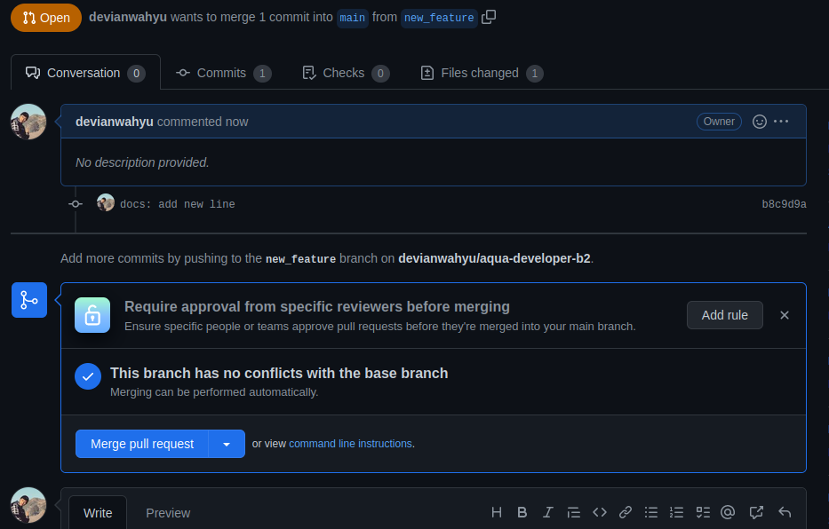

# **Aqua Developer Batch 2 Day 02**

tanggal: 23 Agustus 2022

agenda: praktikum GIT

## **Generate Repo (Github)**

keterangan: Melakukan generate repo online pada github

## **Init**

keterangan: Melakukan init git pada directory projek

## **Add**

keterangan: Merubah area dari perubahan dari working area ke staging area

## **Commit**

keterangan: Melakukan commit perubahan agar siap di push

## **Branch Main**

keterangan: Men-generate branch utama dengan nama main

## **Remote**

keterangan: Melakukan link dari local repo ke remote repo

keterangan: Melakukan pengecekan apakah sudah ada remotenya

## **Status**

keterangan: Melakukan pengecekan state perubahan

## **Push**

keterangan: Melakukan push ke repo online pada github

## **Branch New Feature**

keterangan: Menambahkan branch baru dengan nama new_feature

## **Add, Commit, Push New Feature**

keterangan: Menambah fitur di branch new feature

## **Merge**

keterangan: Melakukan merge perubahan di repo remote

keterangan: Menghapus branch yang sudah di merge

## **Fetch**

keterangan: Mengatur ulang struktur di local menyesuaikan dengan remote branch

keterangan: Pindah ke branch main sebelum menghapus branch new_feature

keterangan: Menghapus branch local yang sudah dihapus di remote repo

## **Pull**

keterangan: Melakukan pull dari repo online ke repo local

## **Stash**

keterangan: Melakukan edit file

keterangan: Memindah perubahan dari working area ke stash

keterangan: Melihat list stash yang tersedia

keterangan: Mengambil ulang perubahan dari stash area ke working area